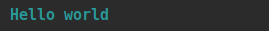
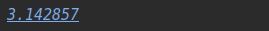

# Colored Console
Kotlin DSL ANSI Ouput Colored Console

#### Simple Examples

```kotlin
colored {
    println("Hello world".cyan.bold) 
}
```


```kotlin
colored {
    // use Cyan as backgroud color
    println("Hello world".cyan.bg)  
}
```


```kotlin
colored {
    // coloring/styling can by called on any object not just String
    val pi = 22f/7
    println(pi.blue.italic.underline)
}
```


#### Custom Styles
```kotlin
colored {
    // custom style: characters + or . can be used to group styles
    val header = green + underline + bold 
    println("Hello world"(header))
    
    // or
    
    println("Hello world".style(header))
}
```

#### Conditional coloring
```kotlin
// prints all even numbers in Cyan color
colored {
    println(listOf(1,2,3,4,5).map { it.cyan { it.rem(2) == 0 } }.joinToString())
}

// condition on style
colored {
    val chapter = cyan + underline + bold 
    val chapterNumber = 12
    println("${chapterNumber}. Good Bye world"(chapter) { chapterNumber >= 10 })
    
    // or
    
    println("${chapterNumber}. Good Bye world".style(chapter) { chapterNumber >= 10 })
}
```

