# Colored Console

A small Kotlin DSL for printing colored and styled text to the terminal using ANSI escape codes.

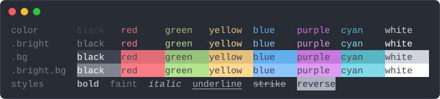

## Features

- **Text styles:** `bold`, `faint`, `italic`, `underline`, `strike`, `blink`, `reverse`, `hidden`
- **Colors:** `black`, `red`, `green`, `yellow`, `blue`, `purple`, `cyan`, `white`
- Bright and background colors
- Reusable custom styles
- Conditional and nested styling
- Styling can be switched off with a single flag
- A single source file with no dependencies, usable in Kotlin Multiplatform common code

## Requirements

The output relies on ANSI escape codes, so it needs a terminal that supports them. Linux and macOS terminals work; Windows is not supported.

## Installation

The library is a single file. Copy [`ColoredConsole.kt`](src/commonMain/kotlin/com/github/mm/coloredconsole/ColoredConsole.kt) into your project. Keep the license notice at the top of the file; the MIT License requires it in every copy.

When you use it from another package, import the functions you need:

```kotlin
import com.github.mm.coloredconsole.ColoredConsole
import com.github.mm.coloredconsole.colored
import com.github.mm.coloredconsole.print
import com.github.mm.coloredconsole.println
import com.github.mm.coloredconsole.style
```

## Usage

Colors and styles are properties you chain onto a value. They are available in two ways:

- `println { … }` and `print { … }` print the text that the block returns.
- `colored { … }` makes the styles available for a whole block of code and returns the block's result.

Both of these print the same output:

```kotlin
println { "Hello world".cyan.bold }

colored {
    println("Hello world".cyan.bold)
}
```

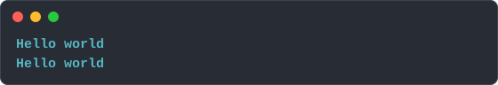

The examples below use whichever form is shorter. Every example works with both.

### Colors and styles

Chain as many colors and styles as you need. They work on any value, not just strings; the value is converted with `toString()`.

```kotlin
val pi = 22f / 7
println { pi.blue.italic.underline }
```

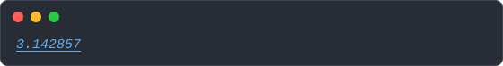

### Background and bright colors

`.bg` turns the color before it into a background color, so you can combine it with a text color:

```kotlin
println { "Hello world".black.cyan.bg }
```

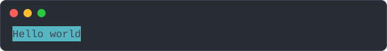

`.bright` switches the color before it to its bright variant:

```kotlin
println { "bright blue".blue.bright.bold }
```

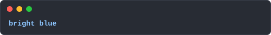

> [!NOTE]
> `.bg` and `.bright` only affect a color they directly follow. `"text".cyan.bg.bold` works, but in `"text".cyan.bold.bg` the `.bg` has no effect. For a bright background, use `.bright.bg`.

### Custom styles

Combine colors and styles with `+` and store the result to reuse it. Apply it by calling the text with the style, or with `.style(…)`:

```kotlin
val header = style { green + underline + bold }

println { "Hello world"(header) }
println { "Hello world".style(header) }
```

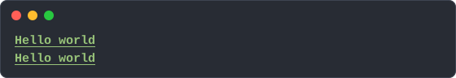

Inside a `colored { }` block, you don't need the `style { }` wrapper. Chaining with `.` works the same as `+`, so `green.underline.bold` is equivalent to `green + underline + bold`:

```kotlin
colored {
    val header = green.underline.bold
    val brightHeader = green.bright + underline + bold
    println("Hello world"(header))
    println("Hello world"(brightHeader))
}
```

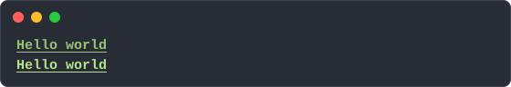

### Conditional styling

Pass a condition to apply a color or style only when the condition is true. The condition receives the value being styled:

```kotlin
// Prints the even numbers in cyan
println { listOf(1, 2, 3, 4, 5).joinToString { it.cyan { n -> n % 2 == 0 } } }
```

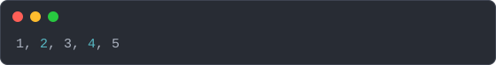

Custom styles accept a condition too:

```kotlin
colored {
    val chapter = cyan + underline + bold
    val chapterNumber = 12
    println("$chapterNumber. Goodbye World"(chapter) { chapterNumber >= 10 })
}
```


### Nested styling

Styles can be nested. Inner text keeps the outer styles and adds its own, and the outer styles continue after it:

```kotlin
colored {
    val inner = ("color " + "Yellow".yellow.bold + " normal").faint
    val middle = ("italic " + inner + " italic").italic
    println(("bold " + middle + " bold").bold)
}
```

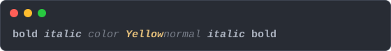

### Turning styling off

Pass `false` to print plain text without any escape codes, for example when the terminal does not support colors:

```kotlin
println(colored = true) { "Orange".yellow.bold + " Is the New " + "Black".bold.reverse }
```

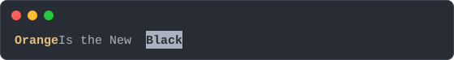

```kotlin
colored(enabled = false) {
    println("Orange".yellow.bold + " Is the New " + "Black".bold.reverse)
}
```

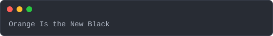

### Styling inside a class

A class that implements `ColoredConsole` can use colors and styles in all of its methods, without a `colored { }` block:

```kotlin
class Weather(val degrees: Int) : ColoredConsole {
    fun display() = println("Degrees:".blue.bold + " $degrees".italic.bold)
}

Weather(22).display()
```

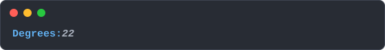

## Development

Build the project and run the tests with:

```sh
./gradlew check
```

The build uses a Java 25 toolchain, which Gradle downloads if it is not installed.

The images in this README are generated from the real output of the examples. After changing an example (in this README and in [`ReadmeImages.kt`](src/jvmTest/kotlin/readme/ReadmeImages.kt)), regenerate them with:

```sh
./gradlew readmeImages
```

## License

Colored Console is licensed under the [MIT License](LICENSE).
